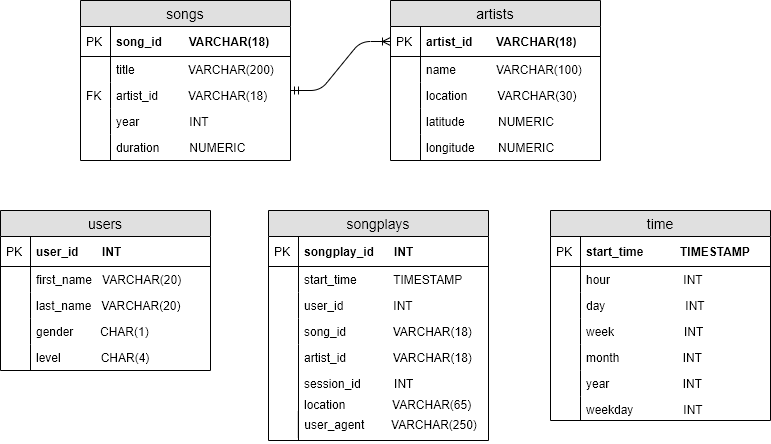

# Introduction - Data Warehouse with AWS

A music streaming startup, Sparkify, has grown their user base and song database and want to move their processes and data onto the cloud. Their data resides in S3, in a directory of JSON logs on user activity on the app, as well as a directory with JSON metadata on the songs in their app.

As their data engineer, we were tasked with building an ETL pipeline that extracts their data from S3, stages them in Redshift, and transforms data into a set of dimensional tables for their analytics team to continue finding insights in what songs their users are listening to.

---

## Project Structure

* __create_tables.py__ : Python script used to create the schema to be used in the analytics database.
* __etl.py__: Python scrpit used to perform the ETL process designed for the analytics database.
* __sql.py__: Python script with the SQL queries used for the previously describe scripts.
* __dwh.cfg__: Config file for the AWS Redshift cluster that holds the analytics database.

---
## HOW-TO

1. Configure the AWS Redshift cluster to use.
2. Update the dwh.cfg file with the relevant details of the cluster configured on step 1.
3. Run the create_tables.py script
4. Run the etl.py 

---
## DB Schema

